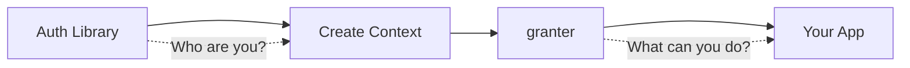

import { Callout } from 'fumadocs-ui/components/callout';
import { Card, Cards } from 'fumadocs-ui/components/card';

# granter

**Composable, type-safe authorization for TypeScript**

<Callout title="Authorization, not Authentication" type="info">
  **granter** is an authorization library (authz), not authentication (authn). It assumes you
  already have an authenticated user and helps you define what they can do.
</Callout>

## Why granter?

- ✨ **Composable** - Build complex permissions from simple rules
- 🔒 **Type-safe** - Full TypeScript inference with generic contexts
- ⚡ **Async-first** - Works seamlessly with databases, APIs, and DataLoader
- 🔧 **Framework-agnostic** - Works with Express, Hono, Next.js, GraphQL, and more
- 🪶 **Zero dependencies** - Lightweight and performant

## Quick Example

```typescript
import { permission, or } from 'granter';

// Define your context
type AppContext = {
  user: { id: string; role: string };
  db: Database;
};

// Create permissions
const isAdmin = permission('isAdmin', (ctx: AppContext) => ctx.user.role === 'admin');

const isPostOwner = permission(
  'isPostOwner',
  async (ctx: AppContext, post: Post) => post.authorId === ctx.user.id
);

// Compose permissions
const canEditPost = or(isPostOwner, isAdmin);

// Use them
const ctx: AppContext = { user: { id: '1', role: 'user' }, db };
const post = await db.getPost('123');

// Check permission
if (await canEditPost(ctx, post)) {
  await db.updatePost(post);
}

// Require permission (throws if denied)
await canEditPost.orThrow(ctx, post);

// Filter array of resources
const editablePosts = await canEditPost.filter(ctx, allPosts);

// Debug why permission was denied
const explanation = await canEditPost.explain(ctx, post);
console.log(explanation);
```

## Installation

```bash
npm install granter
```

## How it Works



1. **Authentication** (external) - Verify user identity with any auth library
2. **Create Context** - Build your app context with user info, database, etc.
3. **Authorization** (granter) - Check permissions based on context
4. **Execute** - Run your application logic

## Next Steps

<Cards>
  <Card title="Getting Started" href="/docs/getting-started" />
  <Card title="Core Concepts" href="/docs/permissions" />
  <Card title="Express Example" href="/docs/express" />
  <Card title="API Reference" href="/docs/api-reference" />
</Cards>
